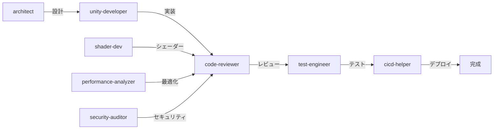

# ShaderOp Claude Code 構成概要

## 📊 統計情報

- **エージェント数**: 12 (Task subagents)
- **スキル数**: 10
- **ルール数**: 3
- **Hooksスクリプト数**: 4

## 🤖 エージェント一覧

### プロジェクト管理（1エージェント）

| エージェント | 専門分野 | 主な用途 |
|------------|---------|------------|
| `project-planner` | プロジェクト計画 | 要件明確化、計画立案、進捗管理、リスク分析 |

### 開発・設計（5エージェント）

| エージェント | 専門分野 | 主な用途 |
|------------|---------|---------|
| `architect` | アーキテクチャ設計 | 機能計画、タスク分解、技術選定、クラス設計 |
| `unity-developer` | Unity C#開発 | MonoBehaviour、UI Toolkit、Addressables |
| `shader-dev` | シェーダー開発 | Shader Graph、HLSL、質感表現、最適化 |
| `automation-dev` | 自動化ツール | Python/JS、アセット検証、ビルドスクリプト |
| `ui-ux-designer` | UI/UX技術設計 | UXML/USS設計、デザインシステム、アクセシビリティ |

### 品質・最適化（4エージェント）

| エージェント | 専門分野 | 主な用途 |
|------------|---------|---------|
| `code-reviewer` | コードレビュー | 品質評価、リファクタリング提案、ベストプラクティス |
| `test-engineer` | テスト設計 | Unity Test Framework、TDD、モック/スタブ |
| `performance-analyzer` | パフォーマンス | Profiler分析、UniTask/UniRx最適化、メモリ管理 |
| `security-auditor` | セキュリティ | 脆弱性検出、OWASP Top 10、機密情報保護 |

### インフラ・ドキュメント（2エージェント）

| エージェント | 専門分野 | 主な用途 |
|------------|---------|---------|
| `cicd-helper` | CI/CD | Jenkins、GitHub Actions、パイプライン構築 |
| `doc-writer` | ドキュメント | 技術ドキュメント作成、README、API仕様書 |

## 📚 スキル一覧

### Unity開発（7スキル）

| スキル | 内容 | 信頼度 |
|-------|------|--------|
| `shader-development.md` | Shader Graph、HLSL、モバイル最適化 | 0.92 |
| `unitask-patterns.md` | 非同期処理、並列実行、タイムアウト | 0.92 |
| `unirx-patterns.md` | ReactiveProperty、通信バッチング | 0.91 |
| `asset-optimization.md` | テクスチャ/メッシュ最適化、Addressables | 0.93 |
| `performance-profiling.md` | ProfilerMarker、GC Alloc削減 | 0.90 |
| `unity-test-framework.md` | EditMode/PlayModeテスト、TDD | 0.94 |
| `ui-toolkit-patterns.md` | UXML/USS、イベント処理、データバインディング | 0.93 |

### アーキテクチャ・設計（1スキル）

| スキル | 内容 | 信頼度 |
|-------|------|--------|
| `architectural-patterns.md` | SOLID原則、デザインパターン（Factory、Observer等） | 0.95 |

### 自動化・CI/CD（2スキル）

| スキル | 内容 | 信頼度 |
|-------|------|--------|
| `python-automation.md` | PIL/Pillow、Pathlib、アセット検証 | 0.90 |
| `jenkins-cicd.md` | Jenkinsfile、パイプライン、デプロイ自動化 | 0.88 |

## 💡 エージェント使用方法

**エージェントはTaskツールで起動します**:

1. `/agents` コマンドでエージェント一覧を表示
2. Taskツールで呼び出し（自動または手動）

**使用例**:
```
「shader-devエージェントでサテンシェーダーを作成してください」
→ Claudeが自動でshader-devエージェントを起動

または明示的に:
「Taskツールでshader-devエージェントを起動して、シェーダーを作成してください」
```

## 📋 ルール一覧

| ルール | 対象言語 | 内容 |
|-------|---------|------|
| `common.md` | 全言語 | 日本語コメント必須、Git規約、セキュリティ |
| `unity-csharp.md` | C# (Unity) | 命名規則、Unity API、UniTask/UniRx |
| `python.md` | Python | PEP8、型ヒント、Pathlib使用 |

## 🔌 Hooksシステム

### セッションライフサイクル

| Hook | タイミング | 機能 |
|------|----------|------|
| `session-start.js` | セッション開始時 | 前回のコンテキスト読み込み、統計表示 |
| `session-end.js` | セッション終了時 | コンテキスト保存、レポート生成 |
| `pre-tool-use.js` | ツール実行前 | セキュリティチェック、自動バックアップ |
| `post-tool-use.js` | ツール実行後 | パターン抽出、統計記録 |

### 自動実行機能

✅ **セキュリティチェック**:
- 機密ファイル（.env、.key、.pem）の検出
- 危険なコマンド（rm -rf、format等）の警告

✅ **自動バックアップ**:
- ファイル編集前に自動バックアップ作成
- `.claude-backups/` に保存

✅ **パターン抽出**:
- C# async/await パターン
- UniTask/UniRx使用パターン
- Python型ヒントパターン
- セキュリティパターン

✅ **統計記録**:
- ツール使用回数
- セッション時間
- 検出パターン数

## 🎯 使用例

### プランニング → 開発 → レビュー → テスト → デプロイ



### ワークフロー例

#### 1. 機能計画
```bash
# architectエージェントを使用
"新しいキャラクターカスタマイズ機能を設計してください"
→ タスク分解、クラス設計、技術選定
```

#### 2. 実装
```bash
# unity-developerエージェントを使用
"CustomizationServiceを実装してください"
→ インターフェース定義、実装、UI Toolkit連携
```

#### 3. シェーダー開発
```bash
# shader-devエージェントを使用
/new-shader "MultiLayerCloth" "HLSL"
→ テンプレート生成、プロパティ設定
```

#### 4. コードレビュー
```bash
# code-reviewerエージェントを使用
"CustomizationService.csをレビューしてください"
→ 品質評価、改善提案、修正コード
```

#### 5. テスト作成
```bash
# test-engineerエージェントを使用
"CustomizationServiceのテストを作成してください"
→ EditModeテスト、PlayModeテスト、モック作成
```

#### 6. パフォーマンス最適化
```bash
# performance-analyzerエージェントを使用
"GC Allocを削減してください"
→ Profiler分析、オブジェクトプール実装
```

#### 7. セキュリティ監査
```bash
# security-auditorエージェントを使用
"プロジェクト全体のセキュリティ監査を実施してください"
→ 脆弱性検出、対策提案
```

#### 8. CI/CD構築
```bash
# cicd-helperエージェントを使用
"Jenkinsパイプラインを構築してください"
→ Jenkinsfile作成、ビルド自動化
```

## 📈 品質保証体制

### コード品質
- ✅ コードレビュー（code-reviewer）
- ✅ 静的解析（セキュリティチェック）
- ✅ コーディング規約（rules/）

### テスト
- ✅ 単体テスト（test-engineer + unity-test-framework）
- ✅ 統合テスト（test-engineer）
- ✅ パフォーマンステスト（performance-analyzer）

### セキュリティ
- ✅ 脆弱性検出（security-auditor）
- ✅ 機密情報保護（pre-tool-use hook）
- ✅ OWASP Top 10チェック

### パフォーマンス
- ✅ Profiler分析（performance-analyzer）
- ✅ GC Alloc最小化（performance-profiling skill）
- ✅ モバイル最適化（asset-optimization skill）

## 🚀 開発効率化

### 自動化
- ✅ アセット検証自動化（automation-dev + python-automation）
- ✅ ビルド自動化（cicd-helper + jenkins-cicd）
- ✅ デプロイ自動化（cicd-helper）

### パターン活用
- ✅ 10個のスキルファイル
- ✅ ベストプラクティス集約
- ✅ コードサンプル提供

### セッション管理
- ✅ 前回のコンテキスト復元
- ✅ パターン自動抽出
- ✅ 統計レポート生成

---

最終更新: 2026-02-21
